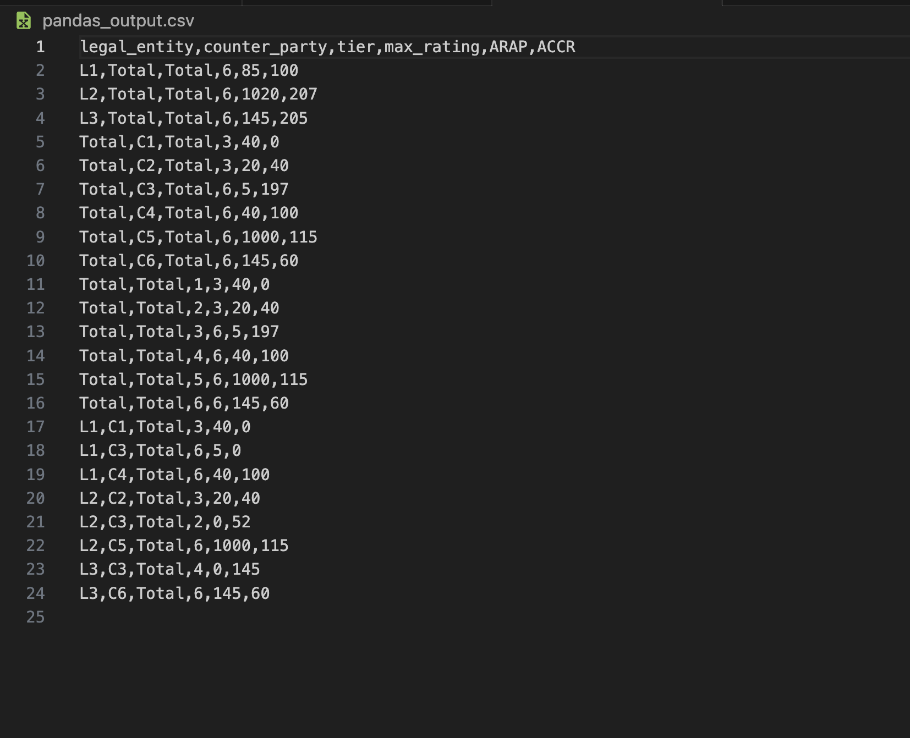
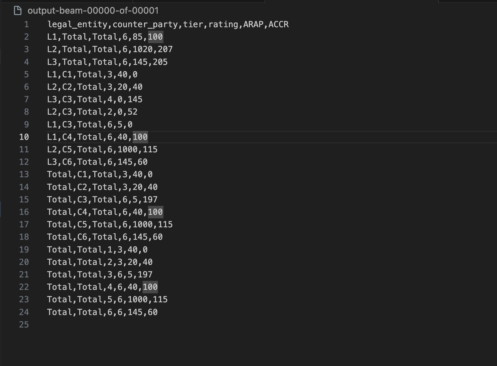

## Overview
This project involves processing data from two input files, dataset1 and dataset2, using two popular frameworks: Pandas and Apache Beam. The goal is to join dataset1 with dataset2 and apply the necessary transformations to the data.

### Prerequirements: Python3

Install Python3: https://docs.python-guide.org/starting/install3/.

Make sure when you run
```
python --version
```

It prints out 'python3' (could be 'python3.9', or 'python3.7', etc).

### Python dependencies

It's best to create virtual environment to keep dependencies of project isolated from system Python packages, and dependencies of other projects.

Create virtual environment:
```bash
python -m venv venv
```
OR
```bash
python3 -m venv venv
```

Activate virtual environment:

For macOS:
```bash
source venv/bin/activate
```

For Windows:
```
venv\Scripts\activate
```

Install libraries needed to run example code from repo:
```
pip install -r requirements.txt
```

### Running Python scripts

Provided previous steps were performed (python installed, virtualenv created, dependencies pip-installed), we can run the scripts using below commands.

1. Pandas Solution (pandas_solution.py):
Execute the Pandas solution script using the following command:
```
python pandas_solution.py
```
  This script will process the data using the Pandas framework, perform the necessary operations, and generate the result_pandas.csv file.

2. Execute the Apache Beam solution script using the following command:
```
python apache_solution.py
```
  This script will utilize Apache Beam to process the data, perform the required transformations, and generate the result_apache_beam.csv file.

### Output

After running the script, we will find the processed data in the specified CSV file (e.g., pandas_output.csv and apache_output.csv) in the root directory.

**1. result_pandas.csv** : Contains the processed data after using the Pandas framework.


**2. result_apache_beam.csv** : Contains the processed data after using the Apache Beam framework.

